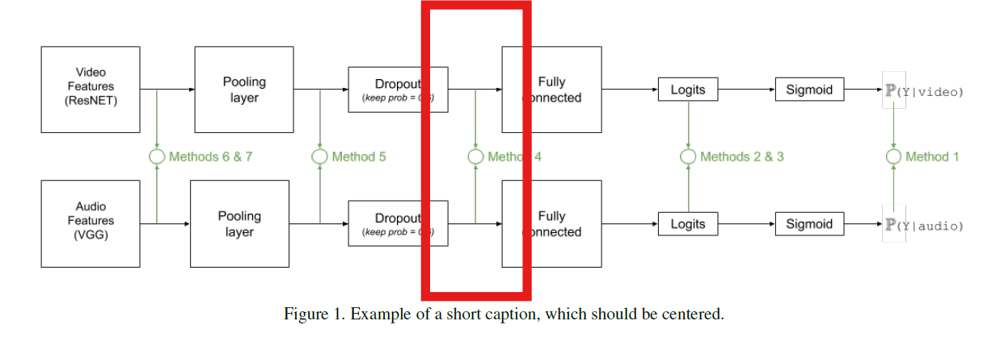
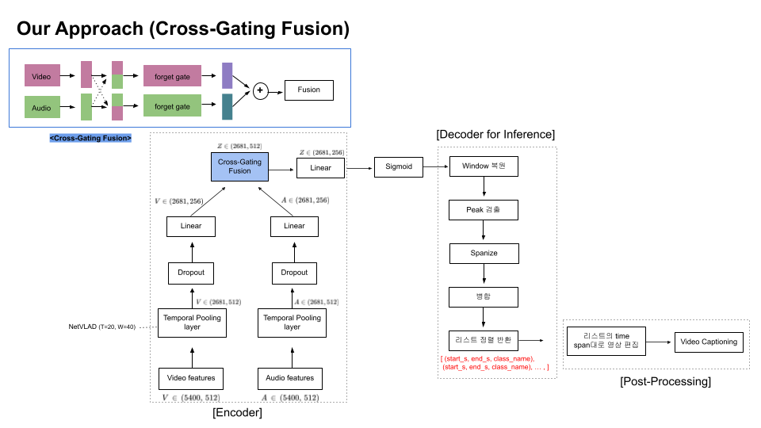
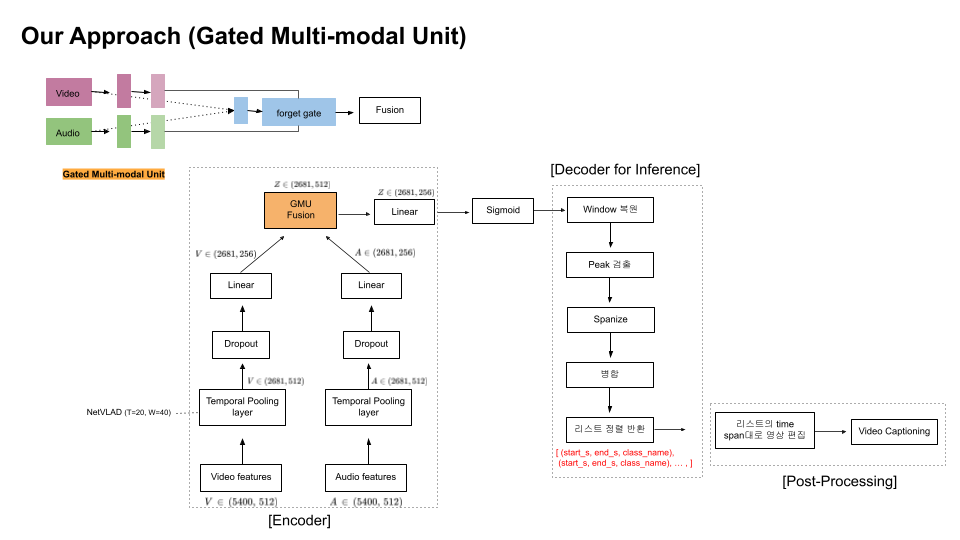
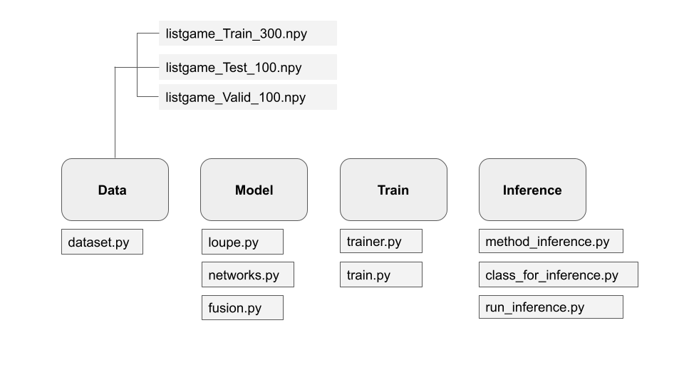

# video-highlight-extraction

21기 전하은 | 22기 서동환 조해진


### 1. 프로젝트 Project

축구 경기 영상에서 하이라이트를 추출하는 멀티모달 모델입니다. 베이스 모델은 [Vanderplaetes and Dupont (2020)](https://arxiv.org/abs/2011.04258) 의 Action-spotting model로, Action-spotting과 함께 비디오 하이라이트를 생성하는 것으로 모델 기능을 확장했다는 점과 CMU, CMGA, Transformer encoder의 여러 fusion 방식을 적용한 점이 주요 차별점입니다. 

① 인풋을 경기 이벤트 라벨로 분류하고(Classification) ② 영상으로 만들 예측 하이라이트 순간을 찾아내고(Action-Spotting) ③ 찾아낸 이벤트로 영상을 만드는 것이 본 프로젝트의 문제입니다. 

This project aims to generate video highlight from given video and audio of Soccer game. Base model is from Action-spotting model following [Vanderplaetes and Dupont (2020)](https://arxiv.org/abs/2011.04258) 
 and [its implementation](https://github.com/bastienvanderplaetse/SoccerNetMultimodalActionSpotting). Major adaptations are as follows. (1) This project handles **both actions spotting and generating video highlights** (2) It also **explores different fusion methods** including GMU, CMGA and transformer encoder to effective process video and audion fusion. 

We define the problem as ① Classifying input chunks to events of interests from a soccer game ② Spotting the event as 'peak' using the threshold ③ Spanning the spotted event to generate video


### 2. 데이터 Data

모든 데이터셋은 SoccerNet 기반입니다. feature data는 사전학습 모델로 추출되었으며, 비디오 데이터에는 ResNet152가 오디오 데이터에는 VGGish가 이용되었습니다. raw data가 인풋으로 들어올 경우 아래와 같이 전처리합니다. 

 ```
Video -> ResNet152 -> TruncatedSVD -> compress feature dimension to 512

 Audio -> VGGish -> PCA -> expand feature dimension to 512
```

데이터 라벨을 기존 17개의 분류를 다음과 같이 새롭게 분류했습니다. 
```
① goal # Shots on-target # Goal
② Kick # penalty kick # Free kick # corner kick
③ Subs 
④ Card # yellow # red
⑤ BG #background
# Discard # Pass # Throw-in # Kick-off # Shots off target # Ball out of play # Clearance # offisde # Foul # Drive
```

All datasets are from SoccerNet. Features are extracted from pretrained models. ResNet152 was used for video data and VGGish for audio. For new input, data of each modality goes through the following procedure.

Additionally, we have organized 17 labels into 4 classes for the task. 
Following is the events of interest. 


### 3. Architecture

Vanderplaetes and Dupon (2020)의 베이스 모델은 오디오와 비디오 인풋을 최종 FC 레이어 직전에 early fusion한 구조입니다. 
 


 
#### Encoder
(1) GMU(Gated Multi-Modal Unit)
(2) CMGA(Cross-Modality Gated Attention) (3) Transformer encoder 방식을 적용했습니다. 

#### Decoder (Inference) 
encoder에서 받은 로짓을 이용해 예측 하이라이트(peak)를 검출하며 사전에 설정한 오프셋을 이용해 하이라이트 영상을 생성합니다. 


<p align="center">
  
  
</p>


The base model from Vanderplaetes and Dupon (2020) employs early fusion by concatenating audio and video input right before the final FC. 

Main difference of our model from the base model is the method of fusion. We have explored different fusion methods from (1) GMU(Gated Multi-Modal Unit) to (2) CMGA(Cross-Modality Gated Attention) and (3) Transformer encoder instead of simple concatenation. 

With the given logits from encoder, decoder spot peaks and span spotted peaks with pre-defined offsets to generate Highlights


### 4. Usage

```bash
git clone https://github.com/Donghwan127/video-highlight-extraction
cd #repo
pip install -r requirements.txt

# train 
python ClassificationMinuteBased.py --architecture CMGAArchi2 --training listgame_Train_300.npy --validation listgame_Valid_100.npy --testing listgame_Test_100.npy --featuresVideo ResNET --featuresAudio VGGish --PCA --network VLAD --tflog Model --VLAD_k 128--WindowSize 20 --outputPrefix vlad-**cmgaarchi2-20sec  --formatdataset 1
**best model 및 설정 확인 필요**
```
```
# inference
bash run_inference.sh
```

### 5. Code Structure


### 6. References
[Vaderplaestse and Dupont (2020)](https://arxiv.org/abs/2011.04258). Improved Soccer Action Spotting using both Audio and Video Streams

[Jiang and Ji (2022)](https://arxiv.org/abs/2208.11893). Cross-Modality Gated Attention Fusion for Multimodal Sentiment Analysis. 

[John et al. (2017)](https://arxiv.org/abs/2208.11893).  Gated Multimodal Units for Information Fusion.

[Giancola et al. (2018)](https://arxiv.org/abs/1804.04527). SoccerNet: A Scalable Dataset for Action Spottin in Soccer Videos.


